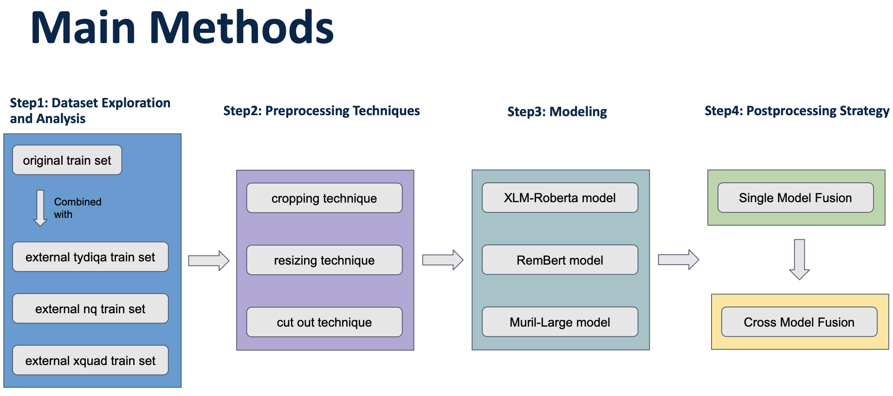

# 595_Final_Project

## Description

With the development of Deep learning and transformer, Question and Answer(QA) task is one of the research area that have major break- through over the past years. Most popular natu- ral language understanding(NLU) models only perform well on English, however the language model often struggle when the input data are In- dia languages, like Hindi and Tamil. To address this research gap, Google research team intro- duced the chaii dataset which contains thou- sands of Hindi and Tamil questions and corre- sponding answers driven from Wikipedia. In this paper, we explore three different models to benchmark on this task: Hindi and Tamil Ques- tion Answering, and also use the advanced pre- process technique and fusion layer to increase the generalization of models. For evaluation, we can achieved 0.796 (best) Jaccard score on the answer prediction, which is much better than the original baseline result.

## Dependencies needed
We run all of our codes on python3.8 with pytorch 1.9. In addition, you should also install packages such as pandas, numpy, sklearn, transformer, tqdm.

## How to run each codes
### for baseline codes:

